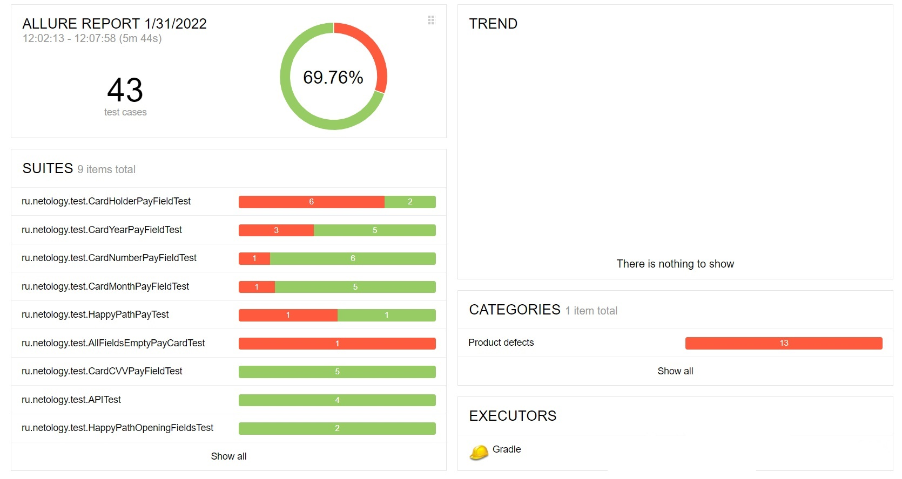
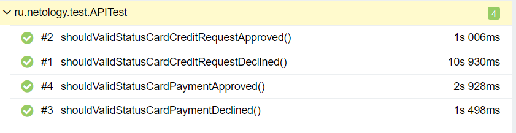
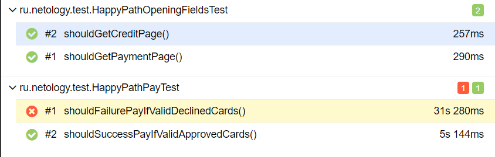
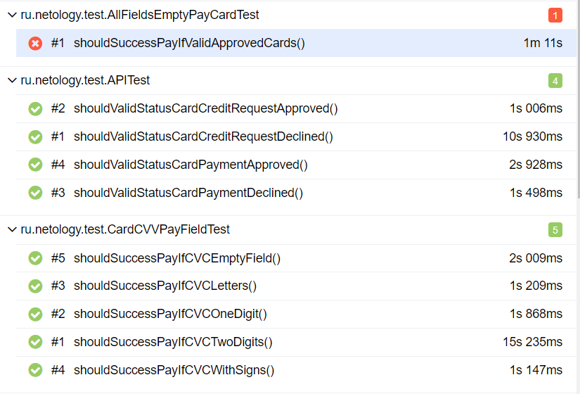
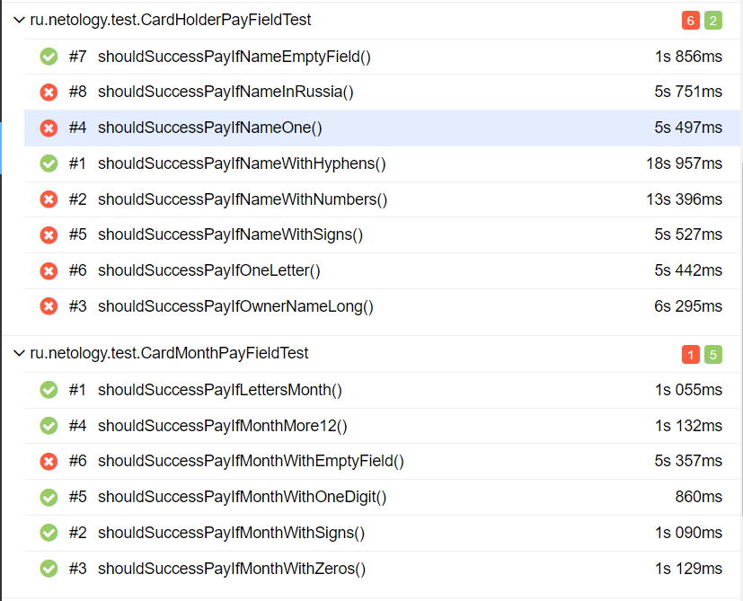
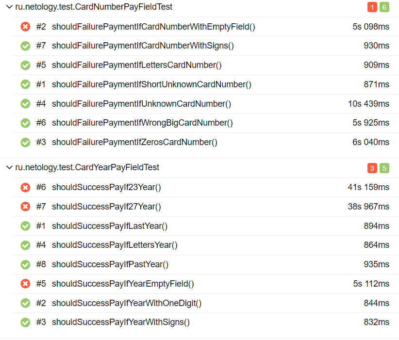

## Отчёт о проведённом тестировании

### Краткое описание

В рамках данного проекта стояла задача - автоматизировать тестирование комплексного сервиса покупки тура, взаимодействующего с СУБД и API Банка.

В ходе тестирования было автоматизированно 43 тест-кейсов. 

Из 43  тест-кейсов: 13 не прошли, 30 прошли. Итого: 69,76% (успешных) / 30,23% (неуспешных). 

### Статистика успешных/неуспешных кейсов

#### API-тесты 

Все тест-кейсы на подключение к БД прошли успено: 

#### UI-тесты 

- Позитивные (HappyPath) тесты, 4 тест-кейса из которых: 1 не прошел, 3 прошли.

- Негативные тесты, 35 тест-кейсов из которых: 12 не прошли, 23 прошли.

### Общие рекомендации

- Исправить орфографическую ошибку на рекламном изображении сервиса покупки тура;
- Исправить неверный текст предупреждений об ошибках, в случаях описанных в [Issues](https://github.com/ller4ik/work/issues);
- В поле "Владелец" исправить валидацию согласно заведенным [Issues](https://github.com/ller4ik/work/issues);
- Убрать сообщение об успешной оплате, находящееся под уведомлением об ошибке, при отправкее данных с невалидным номером карты и иными валидными данными;
- Изменить статус "Успешная операция" на "Ошибка! Банк отказал в проведении операции." при оплате картой со статусом "Declined".

Все подробности об найденных ошибках приложения можно посмотреть в [Issues](https://github.com/ller4ik/work/issues).